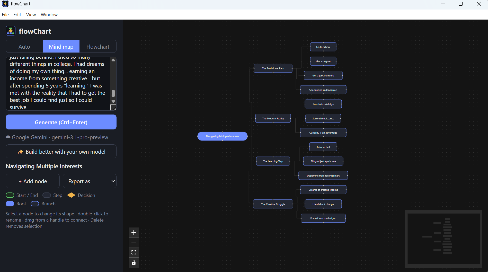
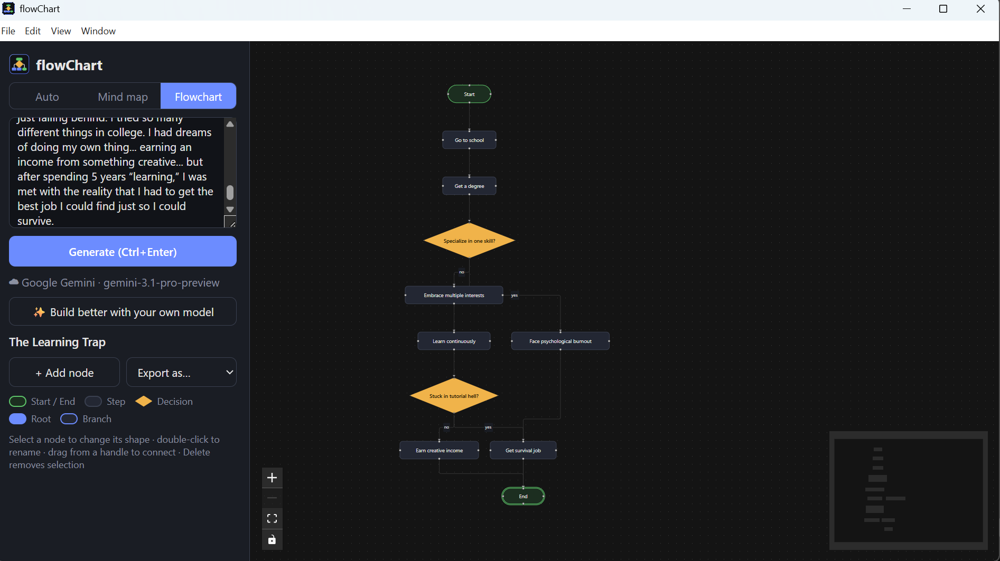

<p align="center">
  
</p>

<h1 align="center">flowChart</h1>

<p align="center">
  Type what you mean. Get an editable mind map or flowchart. No internet, no account, no data leaves your machine.
</p>

<p align="center">
  <a href="https://github.com/saransh121/flowChart/releases/latest"></a>
  <a href="LICENSE"></a>
  
</p>

---

<p align="center">
  <video src="https://github.com/saransh121/flowChart/raw/main/docs/demo.mp4" controls width="720">
    Demo video — see docs/demo.mp4 in the repo if it doesn't play here.
  </video>
</p>

<p align="center">
  
  
</p>

## What it does

- **Text in, diagram out.** Describe a process ("how a support ticket gets resolved") or a topic ("things to consider when buying a laptop"). flowChart picks mind map or flowchart, or you force one with a toggle.
- **Fully offline.** A 1.7B-parameter open model (Qwen3, Apache-2.0) runs on your own CPU or GPU through llama.cpp. Works on a plane.
- **Streams onto the canvas.** Nodes appear and lay themselves out while the model is still thinking.
- **Editable.** Rename with a double-click, change a node's shape (start, step, decision, end), drag to connect, delete, add nodes.
- **Export** to PNG, PDF, PowerPoint, or Word.
- **Optional cloud boost.** Bring your own API key (Anthropic, OpenAI, Gemini, OpenRouter, or any OpenAI-compatible endpoint) for richer diagrams. The key is stored encrypted on your machine and only ever sent to the provider you chose.

## Install

Package managers (after the manifests land):

```bash
winget install saransh121.flowChart          # Windows
brew install --cask saransh121/tap/flowchart  # macOS
```

Grab the latest build for your OS from the [Releases page](https://github.com/saransh121/flowChart/releases/latest):

| OS | File |
|---|---|
| Windows | `flowChart-<version>-win-x64.exe` (installer) or `.zip` (portable) |
| macOS | `flowChart-<version>-mac-arm64.dmg` (Apple Silicon) or `-mac-x64.dmg` (Intel) |
| Linux | `flowChart-<version>-linux-x86_64.AppImage` or `-linux-amd64.deb` |

On first launch the app downloads the model once (1.1 GB) into its data folder. After that it never needs the network again.

> **Windows SmartScreen / macOS Gatekeeper:** builds are not code-signed yet. On Windows click *More info → Run anyway*. On macOS right-click the app → *Open*, or run `xattr -dr com.apple.quarantine /Applications/flowChart.app`.

### Use your own model

Drop any llama.cpp `.gguf` file into the models folder and restart. The largest file wins.

- Windows: `%APPDATA%\flowChart\models`
- macOS: `~/Library/Application Support/flowChart/models`
- Linux: `~/.config/flowChart/models`

Qwen3 0.6B (400 MB) is 2.5x faster and fine for simple diagrams. Anything that chats works, but models under 1B tend to misclassify processes as mind maps.

## Hardware

| Machine | Speed |
|---|---|
| Laptop with integrated GPU (Vulkan), 8 GB RAM | ~15 tok/s, a 12-node flowchart in ~20 s |
| Same laptop, 0.6B model | ~35 tok/s |
| NVIDIA / AMD dedicated GPU | much faster, auto-detected |

CPU-only with 8 GB RAM and the 1.7B model is slow. Use the 0.6B model there.

## Spread the word

See [docs/LAUNCH.md](docs/LAUNCH.md) for the winget / Homebrew / store submission steps and ready-to-paste launch posts.

## Development

```bash
npm install
npm run dev      # Vite + Electron with hot reload
npm run pack     # unpacked build in release/
npm run dist     # installers for the current OS
npm run spike    # the model benchmark used to pick the default model
```

Put a `.gguf` in `./models/` for development, or let the app download one.

### How it works

1. The model is prompted with a system prompt plus two examples and forced, via a GBNF grammar, to emit compact JSON: `{type, title, nodes, edges}`. It never emits coordinates.
2. The renderer parses the JSON prefix as it streams, runs [elkjs](https://github.com/kieler/elkjs) layout on every new node, and draws with [React Flow](https://reactflow.dev).
3. Cloud providers get the same prompt and are parsed the same way, so the UI does not care which engine produced the diagram.

## Roadmap

- Undo / redo, autosave, reopen recent diagrams
- "Edit with AI": describe a change and have the model patch the existing diagram
- Mermaid / JSON export and import
- Auto-update via GitHub Releases
- Hosted web version

## License

MIT. The default model is Qwen3-1.7B by Alibaba, Apache-2.0, downloaded from Hugging Face on first run.
